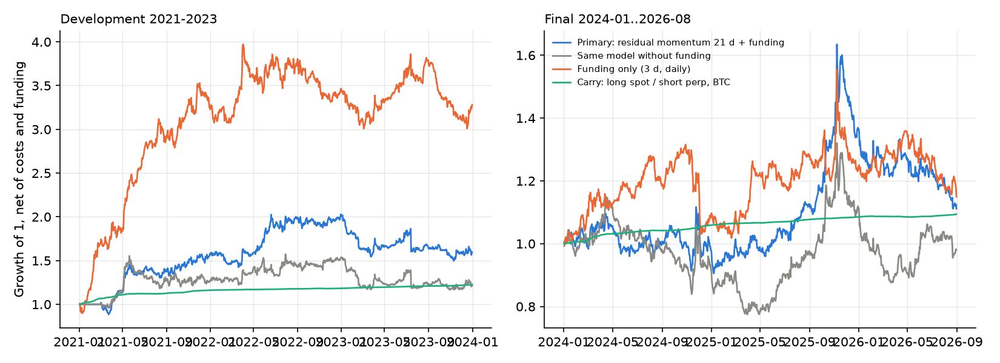

# Funding-Aware Relative Value: Carry, Trader Positioning, and Net Returns

Do perpetual-futures funding rates or trader-positioning data pick long/short positions on
Binance USD-M perpetuals that earn money after fees, slippage, funding and the cost of capital,
and is any gain more than exposure to known factors? The repository has an hourly
self-financing ledger that charges every settled funding payment at its actual time. It runs
three pre-registered searches (51 candidate strategies in total), each selected on development
data and evaluated once on 2024-01 to 2026-08.

This is a personal research project, not a course assignment. It reuses the checksum-verified
download conventions of this author's cross-market study, rewritten as a standalone package.
Development used AI coding assistance; the reviews mentioned in its documents were AI-assisted,
not independent human audits.

## Main result

| Strategy, net of all costs | Development Sharpe / return | 2024-01..2026-08 Sharpe / return | Alpha, HAC t |
|---|---:|---:|---|
| Against the crowd: short the 5 perpetuals whose accounts are most net-long, long the 5 most net-short, every 72 h (Generation 2 primary) | 0.76 / +19.5% (2022-2023) | 0.72 / +18.3% | +27.3% a year vs nine factors, t 2.33 |
| Funding long/short family, 12 registered configurations averaged (Generation 1) | | | +25.2% vs seven factors, t 2.89 (2021-2026); +4.3%, t 0.46, once carry is added |
| Registered Generation-1 primary: 21-day residual momentum + funding | 0.69 / +18.4% (2021-2023) | 0.10 / +6.2% | no increment over funding alone |
| Spot/perpetual carry, BTC (unlevered benchmark) | 6.20 / +6.8% | -2.67 / +3.4% (below T-bills) | known premium |

The strongest result is the positioning strategy. Binance publishes each perpetual's
all-account long/short ratio every 5 minutes. Trading against the most one-sided accounts
earned +18.3% a year net in the held-out period (+14.2% over T-bills). Its intercept against nine
factors is +27.3% a year (t 2.33). The factors are the equal-weight crypto market, BTC, the
S&P 500, 3-week momentum, 1-day reversal, low volatility, illiquidity, the spot/perpetual carry
trade and the funding long/short. The strategy does not load on funding (0.01, t 0.18). It still
earned +13.5% with doubled costs and +25.0% with the positioning data lagged a full day.

The evidence is exploratory, and three facts limit it:
- The interval for the mean return (-11.2% to +44.8%) includes zero.
- In development the strategy was positive in 2022 and negative in 2023.
- The t statistic is HAC (autocorrelation-robust); it does not correct for the search across
  generations and candidates.

The funding family's alpha against seven factors disappears once the carry trade is a factor:
it is a cross-sectional form of the funding-carry premium, strongest in 2021-2023.



## Approach

- **Ledger** (`src/fasa/engine.py`). One USDT account marked hourly. Funding settlements are
  charged at their timestamps to the position held before any fill. Fills happen at the open one
  hour after a 00:00 UTC decision, paying a 5 bps taker fee plus 2 bps (BTC, ETH) or 5 bps
  slippage per side. Portfolios are gross 1.0 of equity, with legs rescaled to zero estimated
  beta, |net| <= 0.25 and |w_i| <= 0.125.
- **Universe.** 40 USDT perpetuals fixed by 2020-12 volume, with later delistings kept; each
  decision uses the 15 with the largest 30-day volume.
- **Settled contracts.** Binance's archive keeps publishing frozen-price bars for some settled
  perpetuals (SXPUSDT was settled 2025-12-05 09:00 UTC per the exchange's announcement; also
  WAVES, OMG and MKR). Bars are cut one hour after a contract's last funding settlement, so a
  held position closes at the settlement price and the contract leaves the universe. This
  correction left every pool result unchanged and slightly raised the transfer test below
  (before and after: `docs/protocol_amendments.md`).
- **Generation 1** (36 candidates): spot/perpetual carry, funding long/short and residual
  signals. After the final, a slow funding rule was frozen and tested once on 60 perpetuals
  outside the pool: Sharpe 0.61, +20.5% a year, interval -7.7% to +55.6%, alpha vs market and
  momentum t 1.33.
- **Generation 2** (14 candidates): open interest, top-trader and all-account ratios, and taker
  flow, protocol frozen before any positioning file was downloaded.

## Quick start

```bash
make test                                    # ledger tests (offline)
make demo                                    # synthetic panel through the same ledger
make data reproduce                          # Generation 1: ~100 MB of public archives
make data-positioning reproduce-positioning  # Generation 2: 63,837 daily archives, 0.7 GB (about 15 min)
```

## Data and limitations

Public Binance archives (https://data.binance.vision), each checked against its published
SHA-256: hourly perpetual and spot klines, the settled funding history, and daily positioning
metrics (5-minute rows, normally stamped 00:00-23:55). The decision at 00:00 uses the last row
stamped before 00:00, normally 23:55 of the previous day, and fills an hour later; a few files
that also carry a midnight row are cut before it ([docs/data.md](docs/data.md)). Binance's REST
documentation describes period-end timestamps for the equivalent ratio, but the archive's
publication time could not be checked here: the REST API refuses this location. The stress with
every snapshot one day older does not depend on this timing. Account ratios count accounts, not
capital, and they are not a verified retail population.

Other limitations:
- Fills and costs are modeled, not observed.
- The capacity table in [reports/results.md](reports/results.md) is a scenario under an
  assumed square-root impact model (net +7.8% a year at $5M and +3.5% at $10M), not measured
  capacity.
- The 2024-2026 BTC/ETH price history overlaps other studies by the same author.
- Liquidation, exchange and counterparty risk are not modeled.

Raw archives and panels are not redistributed; `make data` rebuilds them.

## Read the code

- `src/fasa/engine.py`: ledger, funding timing, matched carry legs, delisting exits.
- `src/fasa/panel.py`: hourly panel and the settled-contract cut (`settle_tails`).
- `scripts/run_positioning.py`: Generation 2 signals, selection, final and nine-factor attribution.
- `scripts/family_significance.py` and `scripts/capacity.py`: factor models and the capacity scenario.
- `tests/test_ledger.py`, `tests/test_positioning_snapshot.py`: hand-checked ledger cases, including
  the settlement cut, and the rule that a snapshot is stamped before the decision.

## References

- M. Schmeling, A. Schrimpf, K. Todorov. Crypto carry. BIS Working Papers 1087, 2023.
  https://www.bis.org/publ/work1087.htm (carry in crypto futures; context for the carry benchmark).
- Y. Liu, A. Tsyvinski, X. Wu. Common Risk Factors in Cryptocurrency. *The Journal of Finance*
  77(2), 1133-1177, 2022. https://doi.org/10.1111/jofi.13119 (market and momentum factors; the
  factors here are built within this universe, not theirs; no size factor, because market caps are
  not in the public archives).
- W. K. Newey, K. D. West. A Simple, Positive Semi-Definite, Heteroskedasticity and
  Autocorrelation Consistent Covariance Matrix. *Econometrica* 55(3), 703-708, 1987.
  https://doi.org/10.2307/1913610 (HAC standard errors).
- B. Toth, Y. Lemperiere, C. Deremble, J. de Lataillade, J. Kockelkoren, J.-P. Bouchaud.
  Anomalous price impact and the critical nature of liquidity in financial markets. *Physical
  Review X* 1, 021006, 2011. https://doi.org/10.1103/PhysRevX.1.021006; J. Donier, J. Bonart. A
  million metaorder analysis of market impact on the Bitcoin. *Market Microstructure and
  Liquidity* 1(2), 2015. https://doi.org/10.1142/S2382626615500082 (square-root impact scenario).
- D. H. Bailey, J. M. Borwein, M. Lopez de Prado, Q. J. Zhu. The Probability of Backtest
  Overfitting. *Journal of Computational Finance* 20(4), 39-69, 2017.
  https://doi.org/10.21314/JCF.2016.322 (why the trial count is reported).
- Binance: funding-rate history and long/short ratio definitions,
  https://developers.binance.com/docs/derivatives/usds-margined-futures/market-data/rest-api/Get-Funding-Rate-History
  and .../rest-api/Long-Short-Ratio; SXPUSDT settlement announcement,
  https://www.binance.com/en/support/announcement/detail/746056ce732d43dda12c1e5ae1b7a059.

The positioning rule itself is this project's own exploratory hypothesis; no paper is its
source. Methodology: [docs/methodology.md](docs/methodology.md); data card: [docs/data.md](docs/data.md).
