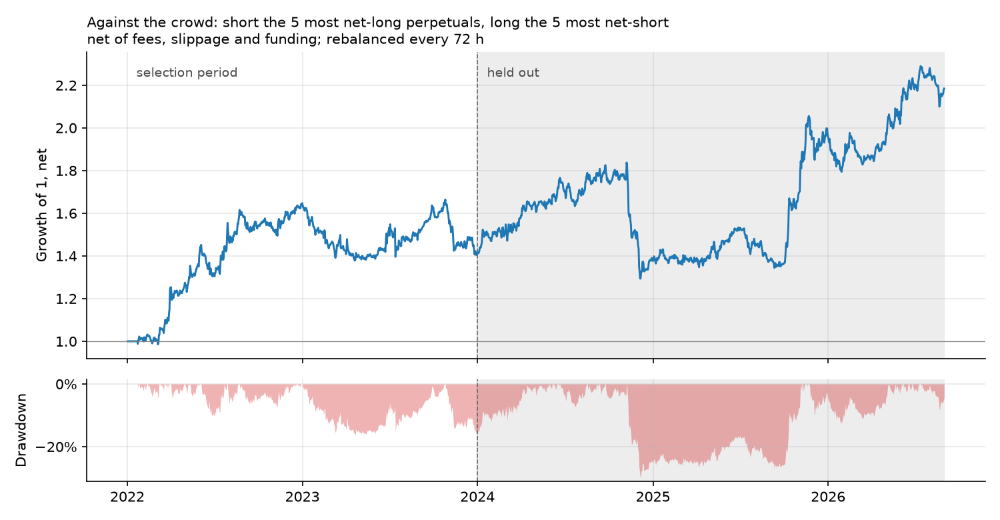

# Funding-Aware Relative Value on Crypto Perpetuals

I tested whether funding rates and trader-positioning data can select profitable long/short
positions after trading costs. I built an hourly portfolio ledger, compared carry, funding and
positioning strategies, and used factor regressions to check what drives their returns.

## Results

The strongest candidate trades against the crowd: short the five perpetuals with the highest
long/short account ratios, long the five with the lowest, and rebalance every 72 hours.
I selected it on 2022-2023 data and evaluated it on 2024-01 to 2026-08.

| Against-the-crowd strategy | Selection: 2022-2023 | Evaluation: 2024-01..2026-08 |
|---|---:|---:|
| Annualized mean return, net of modeled costs | +19.5% | +18.3% |
| Sharpe ratio, excess over T-bills | 0.76 | 0.72 |

- **Positioning:** the evaluation return stayed positive with doubled costs (+13.5%) and with
  the signal delayed by a full day (+25.0%). Its nine-factor intercept was +27.3% a year
  (HAC t 2.33).
- **Funding:** the funding long/short family's estimated alpha was no longer significant after
  adding spot/perp carry as a factor, consistent with exposure to the carry premium.
- **Interpretation:** I treat positioning as exploratory. Its 95% mean-return interval is
  -11.2% to +44.8%; it lost money in the 2023 selection fold, and the t statistic does not
  adjust for the search across 51 candidates. The strategy families reuse the same evaluation
  calendar; [protocol history](docs/protocol_amendments.md) records the sequence.



## Data

- Public Binance archives: hourly spot/perpetual prices, funding settlements and five-minute
  positioning metrics. I checked downloads against their published SHA-256 checksums.
- A pool of 40 USDT perpetuals selected by 2020-12 volume, retaining later delistings; the
  15 largest by trailing 30-day volume are eligible at each decision.
- FRED S&P 500 prices and the three-month T-bill rate for attribution and excess returns.

Account ratios count accounts, not capital. Archive publication times are unverified, which
motivates the one-day-delay check. Fills and costs are modeled; liquidation and counterparty
risk are outside the simulation. BTC/ETH dates overlap other portfolio studies.
[Data details](docs/data.md).

## Method and code

- `src/fasa/engine.py`: hourly accounting, funding on pre-trade positions, carry legs and
  delisting exits. A midnight decision fills at the next hourly open, with fees and slippage.
- `src/fasa/strategies.py`: long/short portfolios targeting unit gross exposure, with leg
  weights adjusted using estimated betas and constrained by net and position limits.
- `scripts/run_positioning.py`: positioning signals, selection and factor attribution.
- `tests/`: hand-calculated accounting cases and checks of information timing.

## Run locally

Use Python `3.11` or newer, from the repository directory:

```bash
python3 -m venv .venv
source .venv/bin/activate
python -m pip install -e '.[dev]'
make check     # offline tests, lint and saved-result claim checks
make demo      # synthetic example
```

Saved tables: [reports/results.md](reports/results.md). Data preparation and evaluation:
[docs/methodology.md](docs/methodology.md). The recorded evaluation periods have already been
used; rerunning them is reproduction, not a new test.

## References

- Schmeling, Schrimpf & Todorov (2023), *Crypto carry*, BIS Working Papers 1087.
- Liu, Tsyvinski & Wu (2022), *Common Risk Factors in Cryptocurrency*, Journal of Finance.
- Newey & West (1987), *A Simple, Positive Semi-Definite, Heteroskedasticity and Autocorrelation
  Consistent Covariance Matrix*, Econometrica.
